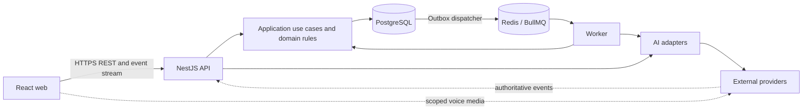

# FluentCoach AI — Product and architecture specification

Status: M00 decisions accepted and M01 foundation implemented, 2026-09-29.
Product behavior remains unimplemented.

## 1. Intent and success

Help a Spanish-speaking learner improve spoken English through regular,
level-appropriate conversations and feedback that carries across sessions.
Initially serve one real learner, while isolating accounts from the beginning.
Durable learner state and learning workflows distinguish this product from a
chatbot wrapper.

The first learner pilot requires voice, both tutor modes, A1–B2 settings, Spanish
help, profiles, history, and automatic feedback. Text is an intermediate delivery
milestone and an accessible fallback, not a replacement for the voice pilot.
Adaptive features add recurring-error insights, plans, vocabulary and reviews.

Measure completed practice, voluntary repeat use, learner-rated clarity and
correction timing, and human-reviewed feedback quality. Establish a learner
baseline before claiming improvement. More practice alone does not establish a
CEFR increase.

## 2. Goals and non-goals

Goals: natural voice conversations; useful level-aware feedback; durable,
evidence-backed learner memory; explainable personalization; accessible practice;
typed modular software; reliable background work; tested deployment and recovery;
secure configuration; measurable quality, latency and cost.

Initial non-goals: official CEFR certification; native mobile apps; offline AI;
group/video tutoring; custom model training; microservices/Kubernetes; payments
or public signup; pronunciation scoring from transcripts; teacher/family access
or exam implementation. Doctor visits are language role-play, not medical advice.
Future sharing and exam modes need separately reviewed specifications.

## 3. Decisions and unresolved assumptions

Defaults below permit planning; they are not facts about the learner. Resolve
each gate before the affected implementation or real-data use. Record material
choices in future `docs/adr/` decision records.

| Decision | Proposed default and reason | Gate |
| --- | --- | --- |
| Learner age/ownership | Adult, private invitation-only account | Verify before collecting real data; minors require separate consent/access design |
| Initial level | Self-selected A1, A2, B1 or B2; optional onboarding exercise | M02; never silently replace selection with inferred proficiency |
| Interface | Spanish UI/help, English practice; language preference editable | Validate with learner in M02 |
| Devices | Latest/current-previous iPhone/iPad Safari, Android Chrome, desktop Chrome/Edge; text fallback | M00 target resolved; verify actual devices in M06 |
| Practice goal | Editable default of 10 minutes, three days/week | Validate in M02 |
| Correction timing | Natural: after session; Teaching: after completed turns | Script review M03, live review M05/M06 |
| Stack | M01 pins Node 20.20.x, pnpm, strict TypeScript, React/Vite, NestJS, PostgreSQL and Redis; Prisma/BullMQ when owned by later milestones | M00 compatibility resolved; review runtime support before production |
| AI vendor/model | OpenAI Responses with `gpt-5-mini` initial candidate, plus deterministic fake | M00 resolved; live quality/cost/privacy evaluation gates M05/pilot |
| Voice transport | Browser-to-OpenAI WebRTC plus API sideband authoritative events; text fallback | M00 architecture resolved; synthetic/live device spike gates M06 |
| Identity | Auth0 EU OIDC tenant, closed sign-up, secure server sessions | M00 resolved; plan/DPA configuration gates real access |
| Hosting | Render Frankfurt web/API/worker plus managed PostgreSQL/Key Value | M00 selected; price/service verification and deployment drill gate M11 |
| Load/cost | Private pilot; five concurrent sessions; $10/month app AI hard cap and $50/month total approval ceiling | M00 resolved; re-quote before any spend |
| Data retention | No application audio storage; transcripts/reports 90 days; structured learner state until deletion | Confirm before pilot, including independent provider retention |
| Pedagogical review | Reviewed Spanish-learner examples and tutor rubric | Identify reviewer before pilot; no unsubstantiated validation claim |

No need to select future dashboard roles or exam rubrics now. Do not silently
resolve privacy/budget/provider gates by enabling services or collecting data.

## 4. Functional requirements

| ID | Requirement and observable behavior |
| --- | --- |
| F01 | Save profile: interface/native language, IANA timezone, selected CEFR, interests, practice goal; persist across logout/devices. |
| F02 | Start a session with restaurant, travel, hotel, shopping, doctor-visit or free-conversation scenario, level and mode; snapshot settings. |
| F03 | Tutor adjusts vocabulary, sentence length and scaffolding for A1–B2, asks useful follow-ups and leaves room for learner speech. Evaluate behavior, not merely prompt text. |
| F04 | Natural Conversation defers corrections to the report but can clarify misunderstood meaning. Teaching Mode offers one brief useful correction after a completed turn, an example and optional retry. No grammar correction mid-utterance. |
| F05 | Visible “No entiendo / I don't understand” action and explicit spoken/text requests trigger simpler English, a short Spanish explanation, then an invitation to continue in English. Help is not a grammar mistake. |
| F06 | Voice has permission flow, activity indicators, mute/stop/end, captions, tutor-playback interruption, reconnect/errors and text fallback. Never label unheard/cancelled output as delivered. |
| F07 | History shows session settings, status, transcript availability and report status; repeated end requests do not duplicate reports. |
| F08 | Automatically produce strengths, up to three priority corrections, transcript evidence, explanations and practice suggestions. Show pending/failed/retry states; empty sessions produce no fabricated feedback. |
| F09 | Aggregate recurring grammar/vocabulary issues across distinct sessions using normalized categories; retain evidence/uncertainty and allow dismissal. |
| F10 | Propose a small personalized plan using level, goals, recurring issues and due vocabulary; explain priorities; allow accept/skip/refresh. |
| F11 | Track phrase/lemma, contextual meaning, Spanish translation, example, source and status. Learner confirms suggestions before scheduled review. |
| F12 | Spaced repetition uses a deterministic, versioned algorithm and ratings; duplicate review submission cannot advance twice. |
| F13 | Show minutes, sessions, goals, speaking streaks, review activity and evidence-based issue trends; display insufficient-data states instead of invented fluency scores. |
| F14 | Account-scoped history, export and deletion cover API, streams, derived state and background jobs. |
| F15 | Future exam practice and teacher/family dashboards require assessment, consent and authorization specifications before implementation. |

Proposed streak rule: consecutive local dates with at least two minutes of
validated active voice practice; exclude idle connection time and track text
practice separately. Persist each event's timezone/local date so later timezone
changes do not rewrite history. Weekly goals start Monday in learner timezone.
Review these defaults with the learner before M09 acceptance.

## 5. High-level architecture

Use a modular monolith, deployed as web, API and background-worker processes from
one repository. Modules coordinate through application interfaces and events,
not a network of microservices. PostgreSQL is canonical; Redis holds queue/cache
state. API and worker share domain/application logic.



Dotted paths depend on the voice spike. Without scoped controls and authoritative
events, use a backend media adapter. Client transcripts are untrusted and cannot
be authoritative provider usage or assessment evidence.

Modules: Identity/Access, Learners, Scenarios, Tutoring/Sessions, Analysis,
Vocabulary/Reviews, Learning Plans, Progress, Operations. Each owns its writes.
Use a single relational database with explicit foreign keys and transactions.

Proposed layout:

```text
apps/web/                 UI, accessibility, browser media
apps/api/                 HTTP/stream transport, identity, dependency wiring
apps/worker/              outbox dispatch, analysis, lifecycle jobs
packages/domain/          pure policies, entities and value types
packages/application/     use cases and ports
packages/contracts/       runtime-validated DTOs and event schemas
packages/infrastructure/  persistence, queues, identity and AI adapters
packages/testing/         synthetic fixtures and deterministic providers
docs/adr/                 decision records
infra/                    containers and deployment configuration
```

Strict TypeScript and runtime validation cross trust boundaries. Prisma owns
migrations; Vitest covers unit/integration tests; Playwright covers browser
flows; telemetry is OpenTelemetry-compatible. Pin compatible supported versions
at implementation. React/Vite fits an authenticated app without initial SEO
needs; NestJS gives explicit modules, but framework decorators stay outside the
domain. Avoid dependencies introduced solely for hypothetical scale.

## 6. Frontend/backend boundaries and contracts

Frontend owns presentation, transient UI state, microphone permission, playback,
captions, keyboard access and connection state. Backend owns authorization,
settings/policy, transcript ordering, prompts, provider credentials, persisted
feedback, review schedules, progress, costs and background coordination.

Proposed `/api/v1` resources: `/me`, `/learner-profile`, `/scenarios`, `/sessions`,
`/sessions/:id/turns`, `/sessions/:id/help`, `/sessions/:id/end`,
`/sessions/:id/voice-connection`, `/sessions/:id/events`, `/sessions/:id/report`,
`/vocabulary`, `/reviews/due`, `/reviews`, `/learning-plans`, `/progress`,
`/exports`, `/account/deletion`. Exact schemas/OpenAPI follow in implementation.

REST handles queries/commands; server-sent events carry text/report progress
with monotonic IDs and resumable cursors. Voice is a separate transport. Use
bounded payloads, cursor pagination, stable error codes and correlation IDs.
Relevant mutations accept account-scoped idempotency keys. Cookies are secure,
HttpOnly, same-origin; protect mutations against CSRF and validate origins.

## 7. Initial domain model and database entities

Use UUIDs, UTC timestamps, foreign keys and optimistic versions on mutable
aggregates. Every account-owned row carries `account_id`; composite constraints
and repositories prevent cross-account references. Queryable state uses typed
columns; bounded report/config JSONB requires versioned runtime schemas. Do not
use a single opaque learner-memory blob or expose ORM/provider models as DTOs.

| Entity | Important fields and constraints | Introduce |
| --- | --- | --- |
| Account | Unique OIDC issuer + subject; active/deleting status; timestamps | M02 |
| LearnerProfile | One/account; languages, timezone, selected CEFR, interests, version | M02 |
| PracticeGoal | Profile, minutes/day, days/week, effective dates; one current goal | M02 |
| ConsentRecord | Account, purpose, policy version, grant/revocation times | M02 |
| Scenario | Unique slug + version, levels, objectives, role and constraints | M03 |
| PracticeSession | Profile/account, scenario version, level/mode snapshots, channel, state, start/end, terminal reason, prompt/config versions | M03 |
| ConversationTurn | Session/account, unique sequence and source event key, speaker, final text, language, delivery state, source, timestamps | M03 |
| SessionEvent | Session/account, unique monotonic sequence/source event ID, kind, bounded payload, occurred/received times | M03 |
| ProviderRun | Session/analysis, operation, adapter/model, prompt/schema versions, usage/cost estimate, latency, outcome | M04 |
| OutboxEvent | Account/aggregate, versioned event type, payload reference, unique dedupe key, publication time/attempts | M04 |
| AnalysisRun | Session/account, transcript revision, analyzer version, status/attempts/error; unique session + revision + analyzer version | M04 |
| SessionReport | Unique analysis FK, validated versioned content, evidence references, generation time; one current report/session | M05 |
| ErrorObservation | Report/account, taxonomy key, grammar/vocabulary type, turn/span evidence, suggestion, uncertainty, dismissed flag | M07 |
| LearnerIssue | Unique profile + taxonomy key, distinct-session count, first/last observation, status; rebuildable | M07 |
| VocabularyItem | Profile, normalized phrase + sense + language unique, meaning/example, translation, source and confirmation | M08 |
| ReviewCard | Unique vocabulary FK, algorithm version, due time, interval/state, optimistic version | M08 |
| ReviewAttempt | Card/account, rating, prior/next state, review time; unique account-scoped request key | M08 |
| LearningPlan | Profile, version, inputs/evidence, status/time; at most one active plan | M09 |
| LearningActivity | Plan, objective, allowed scenario/issue/vocabulary references, completion/skipped state | M09 |
| PracticeEvent | Session/account, unique event key, active voice seconds, timezone/local date snapshot | M09 |
| DailyProgress | Unique profile + date, derived voice/text totals, sessions/reviews; rebuildable | M09 |
| DataRequest | Account, export/delete type, state, expiry/completion time | M10 |

Relationships: account 1–1 profile; profile 1–many sessions, goals, issues,
vocabulary and plans; session 1–many turns/events/analysis runs; analysis 0–1
report; report 1–many observations; vocabulary 0–1 card; card 1–many attempts.
Report evidence can only reference its own session. Create tables incrementally.
Index account + creation time for history, session + sequence for replay,
profile + due time for reviews, and pending status for outbox/worker polling.

## 8. State and consistency

Session transitions: `created -> active -> ended`; `created/active -> abandoned`
or `failed`. Terminal transitions are idempotent. Reconnecting is transport
state and cannot reactivate an ended session. Separate analysis lifecycle:
`pending -> running -> succeeded/failed`, with explicit retries under the same
logical key. Report failure never erases session history. Abandoned sessions
with usable turns may yield a clearly partial report; empty ones are skipped.

On end, allow a bounded five-second finalization window, freeze a transcript
revision, and atomically commit terminal session, analysis run and outbox event.
Late events require an explicit new revision, not silent mutation of evidence.
Reanalysis atomically replaces the current report; exclude superseded observations.

Outbox dispatch and BullMQ are at least once. Unique keys, transactions and
leases make persistent effects idempotent. External provider calls may still
duplicate after timeouts; do not claim exactly-once billing. Use bounded transient
retries with jitter; permit at most one malformed-output repair; expose permanent
failure. A reconciler requeues persisted work after Redis loss.

Proposed recurrence threshold: three valid observations across two distinct
sessions in 30 days, using a versioned taxonomy. Reanalysis is not another session.
Dismissals, source deletion and supersession rebuild aggregates. Avoid trend
claims without comparable practice volume. Confirmed vocabulary may remain after
source-session deletion with provenance cleared, explained in deletion UI.

## 9. AI-provider abstraction

Application-owned ports express product capabilities rather than vendor APIs:

| Port | Input/output |
| --- | --- |
| ConversationProvider | Versioned TutorContext, bounded turns, deadline/cancellation -> normalized streamed output/events and usage |
| RealtimeVoiceProvider | Policy, scoped identity and required capabilities -> expiring connection descriptor; end/cancel and authoritative events |
| SessionAnalyzer | Immutable transcript + rubric -> validated ReportDraft with evidence and uncertainty |
| LearningPlanGenerator | Bounded structured learner snapshot + allowed activities -> validated proposed plan |
| SpeechTranscriber / SpeechSynthesizer | Optional only if M00 selects a composed voice pipeline |

TutorContext contains level, scenario, correction/help policy, bounded recent
turns and selected structured priorities. User/provider content is untrusted,
never system instructions. AI cannot execute arbitrary tools, SQL or direct
state writes. Application services validate evidence spans, ownership, IDs and
allowed activities before applying results.

Adapters declare streaming, interruption, ephemeral authentication, server-event,
structured-output and usage capabilities. Normalize errors into rate-limited,
timeout, unavailable, invalid-output, unauthorized and unsupported-capability.
Do not silently emulate unsupported features. Apply deadlines, cancellation,
input/output limits and spend checks to every call. Unknown usage remains
unknown and is conservatively budgeted, not treated as free.

Start with one real adapter and a deterministic fake; a second commercial vendor
is not necessary to demonstrate separation. Isolate any browser media SDK behind
a frontend transport adapter. No invisible mid-session vendor switching: reconnect
explicitly using saved context and disclose lost live context.

Version prompts, schemas, rubrics and taxonomy. Feedback remains evidence-backed
and dismissible. Model-reported confidence is not calibrated probability. Do not
derive pronunciation from text or automatically promote CEFR.

## 10. Quality, security and operations

Proposed targets on the agreed devices/network at five concurrent sessions:
API p95 <500 ms excluding AI; text first token p95 <2 s; voice utterance-end to
audible response p95 <2 s; 95% of reports for sessions up to 20 minutes ready
within 60 s. Record sample sizes and network/provider breakdowns. These are
targets, not measured claims. Default session limit: 20 minutes, configurable.

- Account ownership checks apply to all reads, writes, streams and media tokens.
- No application audio storage by default; minimize context sent to providers.
- Encrypt transport, use managed encryption at rest and production secret stores.
- Never log transcripts, raw prompts, tokens or credentials.
- Enforce rate, duration, concurrent-session and spend limits server-side,
  including termination of direct media sessions at expiry.
- Proposed retention: transcript/report purge after 90 days; remove linked raw
  evidence and rebuild aggregates. Retain only permitted structured summaries.
- Account deletion revokes access, cancels jobs and removes derived data; deletion
  epoch checks prevent in-flight workers recreating records. Proposed completion
  within seven days, backup expiry within 30 days, restore replays tombstones.
  Independently verify provider retention/deletion before real-data use.
- Target WCAG 2.2 AA critical flows: keyboard, labels, focus, captions, readable
  feedback and announced status; no audio/color-only information.
- Monitor correlation IDs, latency/errors, reconnects, job age/failure, rejected
  output and estimated cost. Health and dependency readiness are separate.
- Proposed private-pilot availability: 99% monthly; backup RPO 24 h / RTO 4 h,
  demonstrated in a restore drill before pilot.

## 11. Testing and deployment summary

Use deterministic unit tests; real PostgreSQL/Redis integration tests for
transactions/queues; shared adapter contracts; fake-AI browser flows; separate
cost-capped live tutoring and voice evaluations. See DOCUMENTATION.md for the
matrix and PLAN.md for milestone exit gates.

Docker Compose supports local development. Staging/production use isolated
managed containers and data services. CI builds immutable images; deploy staging
automatically and promote the same digest through an explicit production release
gate. Run migrations once per release; use expand/contract compatibility and
tested rollback/restore. No deployment occurs in this planning phase.

## 12. Technical references

- [MDN getUserMedia](https://developer.mozilla.org/en-US/docs/Web/API/MediaDevices/getUserMedia): microphone access requires a secure context and permission; deployed environments use HTTPS.
- [BullMQ idempotent jobs](https://docs.bullmq.io/patterns/idempotent-jobs): design persistent effects to remain correct across retries.
- [PostgreSQL row security](https://www.postgresql.org/docs/17/ddl-rowsecurity.html): possible defense in depth with deliberate policies/roles; decide in M02 alongside mandatory application ownership checks.
