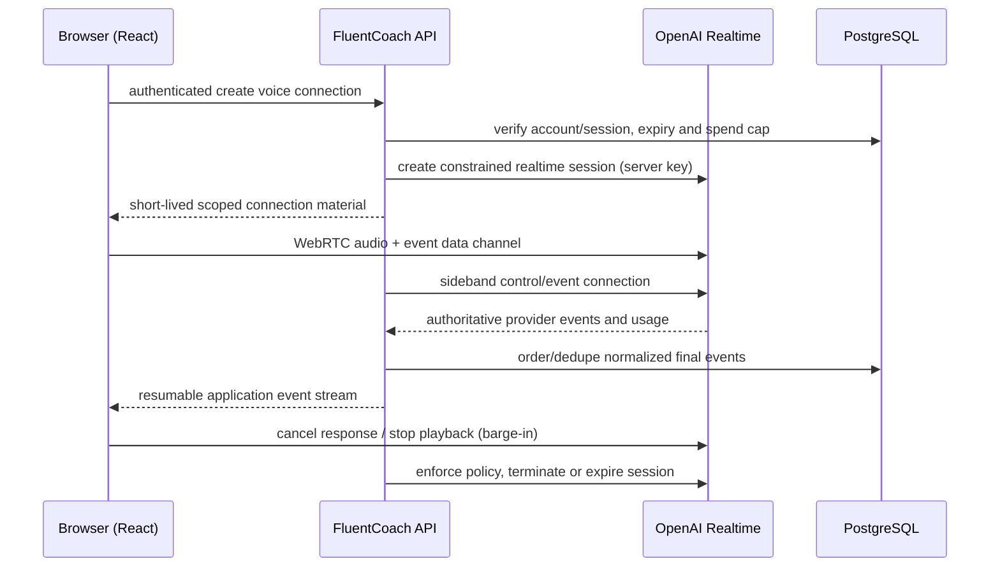

# ADR 0002: AI provider and realtime voice

> **Current provider defaults: ADRs [0010](0010-local-first-ollama-text.md) and
> [0011](0011-local-composed-turn-voice.md).** Ollama local text, whisper.cpp local
> transcription and browser speechSynthesis supersede the historical Gemini
> default below. Gemini text is explicit optional configuration; Live is future
> only. There is no automatic Gemini fallback. Browser TTS is not guaranteed
> offline. The zero-cost policy and raw-audio retention restrictions remain.

> **Amended by ADR 0005.** OpenAI is no longer the initial production provider;
> ADR 0005 historically selected Gemini; ADRs 0010/0011 supersede that default.
> The provider ports, validation and fake-provider decisions remain in force.

- **Status:** accepted for implementation; live-service gates remain
- **Date:** 2026-09-29
- **Decision owners:** product owner (spend/privacy approval) and technical owner
- **Scope:** M00 provider and transport feasibility only

## Context

FluentCoach needs streamed text tutoring, schema-constrained post-session
analysis, and low-latency interruptible speech without putting a permanent API
key in a browser. The application must retain the authoritative transcript and
delivery state. M00 did not have provider credentials and was explicitly barred
from provisioning or spending, so it cannot honestly claim live latency,
interruption, retention configuration, or device validation.

Official OpenAI documentation describes strict JSON-schema Structured Outputs,
the Responses API, and a Realtime API with browser WebRTC, short-lived client
secrets, data-channel events, interruption, and a server-side sideband
connection. See the [Structured Outputs guide](https://developers.openai.com/api/docs/guides/structured-outputs),
[Responses guide](https://developers.openai.com/api/docs/guides/responses),
[Realtime WebRTC guide](https://developers.openai.com/api/docs/guides/realtime-webrtc),
[Realtime conversations guide](https://developers.openai.com/api/docs/guides/realtime-conversations),
and [Realtime server controls](https://developers.openai.com/api/docs/guides/realtime-server-controls).
Published prices are volatile and must be read from the
[official API pricing page](https://openai.com/api/pricing/) before enabling a
model.

## Decision

### Text and analysis

Select **OpenAI as the first production adapter**, with the **Responses API and
`gpt-5.6-terra` as the initial quality-first configuration candidate** for text
tutoring and post-session analysis. The model ID belongs to infrastructure/runtime
configuration, never the domain layer, and is not a permanent dependency. M05's
versioned evaluations may select another model when measured quality and cost
support the change. Use streaming for tutoring and strict Structured Outputs for
report drafts. The application still runtime-validates the normalized report,
evidence spans, referenced turn IDs, account ownership, bounds, and schema
version; provider schema conformance is not authorization or truth.

The adapter must expose request deadline/cancellation, provider request ID,
model snapshot/name, token usage, latency, finish reason, and normalized errors.
Set maximum input/output tokens and an operation budget before each call. Allow
at most one bounded malformed-output repair. Reject rather than partially apply
invalid reports. Do not send arbitrary tools or permit direct application-state
writes.

Send ordinary tutoring and analysis Responses requests with **`store: false`**.
No feature currently requires provider-side response state; enabling it later
requires a separate privacy and architecture review. `store: false` is not a
zero-retention claim: application retention is controlled in PostgreSQL under
ADR 0004, while provider abuse-monitoring retention and any approved Zero Data
Retention (ZDR) or Modified Abuse Monitoring (MAM) controls are separate matters.

Normal development and CI use an application-owned **deterministic fake**. Given
a versioned synthetic fixture key, operation, and seed, it emits a fixed event
sequence, usage figures, virtual timing, cancellation behavior, and selectable
failures (timeout, rate limit, malformed schema, bad evidence, and duplicate
event). It makes no network request and requires no key. Provider contract tests
must run against both normalized fake transcripts and captured, content-free
event shapes; live evaluation remains opt-in and cost-capped.

The reasons for this selection are one provider surface for streamed text,
schema-constrained output and realtime speech; documented browser WebRTC and
sideband control; usage reporting; and low adapter count for a one-user pilot.
Provider concentration and model variability are accepted initially because the
ports and stored normalized events preserve an exit path. A second production
adapter is not M00 or M02 scope.

### Voice transport

Select **`gpt-realtime-2.1-mini` as the current cost-efficient voice candidate**
using **browser-to-OpenAI WebRTC media with an API sideband control/event
connection**. Like the text model, the realtime model is adapter configuration,
not a domain constant. The NestJS API authenticates the learner, checks account/
session state and caps, creates a narrowly configured Realtime session using the
server-held standard key, and returns only a short-lived client secret or the
documented SDP bootstrap response. The browser never receives the standard key.
WebRTC is preferred over relaying audio through our server because the provider
documents it as the browser/client path and it removes an avoidable media hop.



Provider final transcription/response events received and sequenced by the API
sideband are authoritative for durable conversation state. Browser events are
useful for immediate UI but are untrusted hints until reconciled. Record whether
audio output was created, started, interrupted, or completed; never infer that
cancelled/unheard audio was delivered. Do not persist raw audio.

Use provider voice-activity detection initially, while retaining explicit mute,
stop, end, and text controls. Barge-in cancels current generation/playback and
truncates the undelivered assistant item using provider event semantics. A
reconnect creates fresh scoped material, attaches only if the application
session is still active, replays durable events from the last application event
cursor, and reconciles provider items. It never silently creates a second
practice session. Cap a practice voice connection at **15 minutes** initially;
end before the provider maximum, rotate connection material rather than reusing
expired credentials, and make termination idempotent.

If WebRTC setup, microphone permission, sideband authority, or reconnect fails,
offer the same session's text channel. The architectural fallback is a composed
server-mediated STT -> text tutor -> TTS pipeline behind the optional ports, but
it is **not selected or implemented** until M06 measurements show WebRTC is
incompatible. It adds media handling, latency, cost, and privacy surface, so it
is not a casual automatic fallback.

## Feasibility evidence and limitations

The repository inspection confirmed that provider dependencies can remain in
`packages/infrastructure`; domain/application packages are protected by the M01
boundary test. No production feature or SDK was added.

Research attempted on 2026-09-29 from this environment:

```text
curl -L --max-time 20 -sS -o /tmp/m00-page -w '%{http_code}' <official-url>
Observation for every OpenAI/Auth0/Render URL: CONNECT tunnel failed, HTTP 000.
Limitation: the execution environment's outbound proxy returned 403, so linked
official documents were not independently fetched during this run.
```

The documented design is therefore an evidence-based selection, but the
following credentialed work is deliberately **not a passed M00 test**. Item 5 is
the M05 entry gate; the voice items are a mandatory M06 entry gate:

1. In an owner-approved development project with synthetic speech only, create
   a session and record client-secret issued/expiry times without printing it.
2. Connect Chrome/Safari test clients over WebRTC and the API sideband; verify a
   synthetic final transcript reaches the API and duplicate event IDs dedupe.
3. Start a long synthetic assistant response, interrupt playback, and verify the
   durable delivered boundary excludes unheard output.
4. Disconnect/reconnect inside and outside the application expiry; verify event
   replay, fresh credentials, terminal-session rejection, and text fallback.
5. Submit ordinary Responses requests with `store: false`, including valid and
   deliberately invalid report schemas/evidence; verify only the fully validated
   draft can be applied and record usage/latency.
6. Record p50/p95 turn latency, disconnects, provider usage and estimated cost.
   Stop automatically at **USD 5 per spike run**.

No claim of measured provider latency is made. M06 targets should be established
from that run rather than invented now.

## Consequences and review triggers

All AI/realtime calls remain behind application-owned ports. Prompt, schema,
adapter and event-envelope versions are stored. Paid calls are disabled by
default, and production must reject the fake adapter.

Review this decision if the credentialed spike cannot prove server-observed final
events and interruption boundaries, supported browsers fail repeatedly, the
provider cannot meet the privacy gate in ADR 0004, effective cost exceeds caps,
or a material API/model deprecation is announced. A failed WebRTC gate triggers
measurement of the server-mediated fallback; it does not justify changing the
M01 modular architecture.
