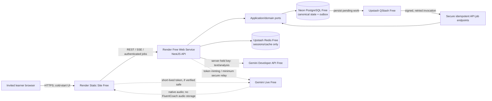

# ADR 0005: Strict zero-cost initial learner pilot

> **Current provider defaults: ADRs [0010](0010-local-first-ollama-text.md) and
> [0011](0011-local-composed-turn-voice.md).** Ollama local text, whisper.cpp local
> transcription and browser speechSynthesis supersede the historical Gemini
> default below. Gemini text is explicit optional configuration; Live is future
> only. There is no automatic Gemini fallback. Browser TTS is not guaranteed
> offline. The zero-cost policy and raw-audio retention restrictions remain.

- **Status:** accepted amendment; deployment re-verification gates remain
- **Date:** 2026-09-29
- **Decision owners:** product owner (terms/consent/any spend) and technical owner
- **Scope:** first real learner only; planning, not provisioning

## Context and zero-cost policy

The first real learner is one invited user and the owner's monthly operating-cost
target is **EUR 0**. The paid-capable topology and OpenAI-first production choices
in ADRs 0002–0004 cannot meet that requirement. The initial pilot therefore runs
with `BILLING_MODE=free_only`:

- no pay-as-you-go service, billing account, payment method, automatic paid
  upgrade, paid overage, or resource that can silently create a bill;
- prefer products usable without enabling billing; free credits and temporary
  paid trials do not qualify;
- quota exhaustion fails closed rather than incurring cost;
- production startup rejects any provider, fallback, feature, or plan that can
  bill in `free_only`; automatic switching to a billable provider is disabled;
- any paid service later requires owner approval and a new ADR. Configuration
  alone cannot authorize spend.

Free tiers and terms can change. Figures below are planning snapshots, not
entitlements. M11 must re-check official plan pages, region availability,
billability/overage behavior, data terms, quotas, and required capabilities
immediately before deployment and record dated evidence. If a service requires
billing or no longer fits, it must be replaced or the pilot remains unavailable.

## Selected zero-cost topology

The React frontend uses Render Static Site Free. The NestJS API uses one Render
Free Web Service and may spin down; the UI shows startup/reconnecting rather than
premature failure. The pilot accepts cold starts, variable latency, free-service
suspension, and no production SLA. There is no always-on Render worker.

Neon PostgreSQL Free is canonical learner state, including outbox and
analysis-pending records. Upstash Redis Free is non-canonical session/cache and
delivery assistance; Redis loss cannot lose learner state. QStash Free delivers
signed HTTPS requests to narrowly authorized background endpoints. Each endpoint
authenticates QStash signatures, is account-scoped, claims persisted work with a
lease, checks deletion epochs, and is idempotent under duplicates, reordering and
retries. A scheduled or on-request reconciler republishes stale pending work
within quotas. Application job ports and versioned envelopes remain
transport-neutral so BullMQ plus a dedicated worker is a future, non-default ADR.

Auth0 Free remains conditional: M02 may use it only after confirming closed
invitation, OIDC Authorization Code + PKCE, required callback/logout settings,
and the one-user flow work without a trial or paid-only feature. No custom domain
is required. Otherwise M02 stops and records a replacement decision.

## AI and realtime voice

The first production adapter is the **Gemini Developer API free tier**. Current
candidates are configurable `gemini-3.8-flash` for text tutoring and structured
post-session analysis, and `gemini-3.8-live` for native-audio Gemini Live
conversation. Identifiers belong in runtime adapter
configuration, never the domain. M05/M06 must reselect a current, officially
supported free-tier model if either is retired. Live models can have a short,
unpredictable lifecycle and can change behavior, quotas, availability or terms;
promotion requires a dated compatibility/device evaluation.

The deterministic fake remains the development/CI default. An OpenAI adapter is
an optional future provider only: it is neither required nor an automatic
fallback and cannot be selected under `free_only` when it can bill. Providers
remain behind application-owned ports; schema, evidence, reference and ownership
checks remain mandatory before applying output.

Gemini Live's officially supported client architecture and ephemeral-token
support must be verified during M06. Preferred flow: the authenticated API checks
ownership, quota and session policy with its server-held permanent Gemini key,
mints a short-lived single-purpose ephemeral token constrained to the Live model
and configuration, and returns only that token for a direct browser Live
WebSocket. The permanent key is never shipped in JavaScript, public config, logs
or browser storage. The API persists authoritative validated final application
events; client/provider events remain untrusted until reconciled.

If ephemeral tokens are unavailable, incompatible with native audio/free tier,
insufficiently scoped, or cannot support authoritative event capture, direct
browser access is rejected. M06 instead measures the minimum secure API WebSocket
relay, which authenticates the learner, holds the server key, and forwards
ephemeral audio/events without recording raw audio. If Render Free cannot safely
sustain it, the real learner pilot is blocked because voice is a core requirement;
text remains available during transient voice outages. The project does not
expose a key or purchase infrastructure to force voice online.

## Privacy: explicit free-tier tradeoff

**Google currently states that content submitted to unpaid Gemini Developer API
services may be used to improve Google products and that human reviewers may
process it.** This is materially different from FluentCoach retention and from
paid-service data terms. State it plainly in Spanish/appropriate learner language
before real use. No real learner text or audio is submitted until the adult
learner explicitly accepts a versioned disclosure covering text, transcripts,
live audio, purposes, provider, withdrawal and alternatives.

FluentCoach stores no raw audio. Its 90-day transcript/report and deletion rules
are application policy and cannot be presented as controlling Google's separate
collection, review, retention, deletion or model-improvement use. M10/M11 re-check
and capture the actual Gemini Free terms, privacy notice, processing locations,
age/authority facts and consent version. If unacceptable, real learner AI/voice
stays disabled; a paid tier is not an automatic remedy under this ADR.

## Free-tier planning limits and closed failure behavior

| Service | Planning snapshot to verify before deployment | Fail-closed behavior |
| --- | --- | --- |
| Render Static Site Free | Free static hosting; public bandwidth/build-minute and deploy limits apply; no paid custom domain required. | Keep last deploy or stop deployments; never upgrade automatically. |
| Render Free Web Service | 750 free instance-hours/workspace/month commonly advertised; spins down after about 15 idle minutes, has cold starts, ephemeral filesystem, constrained CPU/RAM, and may suspend/expire under current rules. | Show starting/reconnecting; deny new work if unavailable. No paid instance fallback. |
| Neon PostgreSQL Free | Advertised per-project compute/storage quotas and scale-to-zero; planning snapshot: 100 CU-hours/project/month and 0.5 GiB/project. | Reject new state-growing work before exhaustion; preserve/export canonical data and resume only when free capacity returns. |
| Upstash Redis Free | Planning snapshot: one free database, 256 MB and 500,000 commands/month; request, bandwidth, record and connection limits apply. | Drop cache/delivery acceleration, re-authenticate if needed, and rebuild from PostgreSQL. |
| Upstash QStash Free | Planning snapshot: 1,000 messages/day with free schedule/log/retention limits; delivery is at least once. | Keep outbox/analysis `pending`, display pending, and reconcile later; never run a paid worker. |
| Auth0 Free | Planning snapshot: up to 25,000 MAU with limited organizations/features/support; custom domains and some security/branding are paid. One invited user is intended. | Block onboarding if the secure invitation/session flow is not free; never depend on a trial. |
| Gemini Developer API Free | Eligibility and rate limits vary by model/project and appear in official rate-limit documentation/AI Studio; capacity is not guaranteed. Candidate limits must be recorded at M05/M06 because Live/text limits change. Free-tier content has the data-use tradeoff above. | A quota/429 prevents a new AI session. Voice failure offers text only if independently available. Never switch to paid/OpenAI. |

These numbers could not be independently fetched in this environment: an
attempt on 2026-09-29 to `curl -L --max-time 30` each official service page was
blocked by the outbound proxy (`CONNECT` 403). This limitation makes the M11
re-check mandatory, not optional. Conservative application admission limits and
provider limits both apply; unknown remaining quota is not permission to call.

## Graceful degradation

- **AI text/analysis quota exhausted:** reject new AI sessions with a clear
  retry-later state; preserve completed sessions and pending analysis.
- **Voice unavailable/quota exhausted/model retired:** offer same-session text
  only when text quota is available; otherwise show retry later.
- **Render cold start/restart:** show starting/reconnecting, bound retries, resume
  from durable cursors, and never duplicate a practice session.
- **QStash unavailable/exhausted:** atomically retain outbox and analysis-pending
  state in PostgreSQL, show pending, and reconcile later.
- **Redis unavailable:** fail or recreate non-canonical sessions safely;
  canonical learner data and pending work remain intact in PostgreSQL.
- **Any free-plan/provider failure:** no billable fallback, hidden upgrade or
  fabricated success.

## Amendments and milestone impact

- **ADR 0002 is superseded** for initial provider/model candidates,
  OpenAI WebRTC/sideband transport and paid evaluation caps. Its abstractions,
  validation, evidence, interruption, no-audio-storage and fake-provider rules
  remain. Gemini/free-only entry gates replace its live procedures.
- **ADR 0003 is superseded** for hosting topology, always-on worker, Render
  PostgreSQL/Key Value, USD 30 fixed plus USD 6 AI estimate, and paid ceilings.
  Its OIDC boundary/session principles remain; Auth0 is conditional on Free.
- **ADR 0004 is amended**: FluentCoach retention/device rules remain, but its
  OpenAI provider-data description does not describe Gemini Free. The explicit
  Gemini model-improvement/human-review disclosure above governs.
- **ADR 0001 is unchanged**. The worker shell may remain for local architecture
  and a future deployment, but is not deployed in the zero-cost pilot.

No milestone is implemented here. M02 verifies Auth0 Free and records the
provider disclosure/consent. M04 targets transport-neutral job ports, QStash API
invocations and PostgreSQL reconciliation rather than a deployed BullMQ worker.
M05 uses Gemini Free and evaluations that cannot incur charges. M06 spikes Gemini
Live ephemeral tokens/relay, model lifecycle and text fallback; inability to
deliver secure zero-cost voice blocks the pilot. M10 validates
the disclosure/deletion boundary. M11 re-verifies every plan, deploys no worker,
proves cold-start/pending/recovery behavior and refuses billing-required resources.

## Consequences and review triggers

Estimated owner operating cost is **EUR 0/month**. Availability, latency,
capacity, support, regional placement and privacy are less predictable than paid
alternatives; this is accepted for one invited learner, not described as
production-grade service. The previous 99% availability and five-concurrent-
session assumptions are not pilot commitments; measurement remains useful.

Review if a free tier changes, billing becomes mandatory, Gemini changes data use
or model availability, quota cannot support one learner, secure Live auth cannot
be demonstrated, or the owner wishes to pay. Review does not permit spend: a new
ADR and explicit approval do. This planning change provisioned no resource,
enabled no billing, and added no payment method, credential, or secret.

## Official sources for the deployment re-check

- [Render free services](https://render.com/docs/free)
- [Neon plans](https://neon.com/docs/introduction/plans)
- [Upstash Redis pricing](https://upstash.com/docs/redis/overall/pricing) and
  [QStash pricing](https://upstash.com/docs/qstash/overall/pricing)
- [Auth0 pricing](https://auth0.com/pricing)
- [Gemini API pricing](https://ai.google.dev/gemini-api/docs/pricing),
  [rate limits](https://ai.google.dev/gemini-api/docs/rate-limits),
  [Live API](https://ai.google.dev/gemini-api/docs/live), and
  [ephemeral tokens](https://ai.google.dev/gemini-api/docs/ephemeral-tokens)
- [Gemini API additional terms](https://ai.google.dev/gemini-api/terms)
